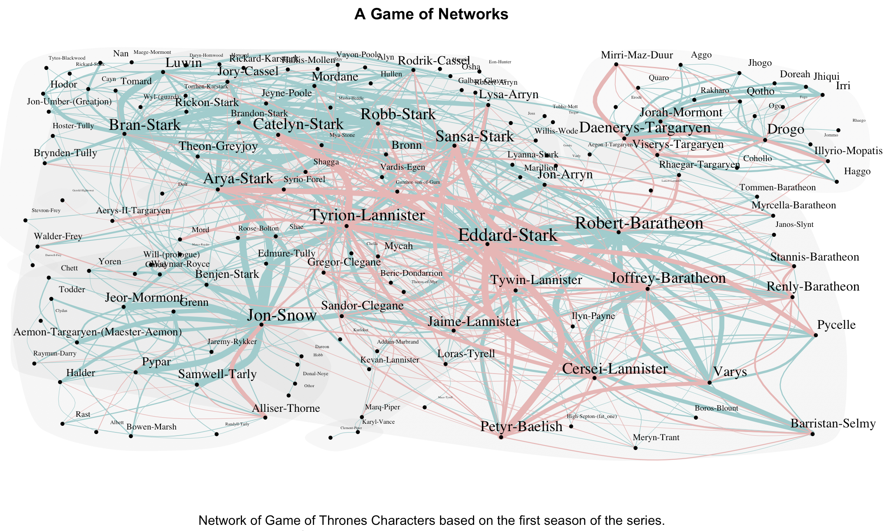
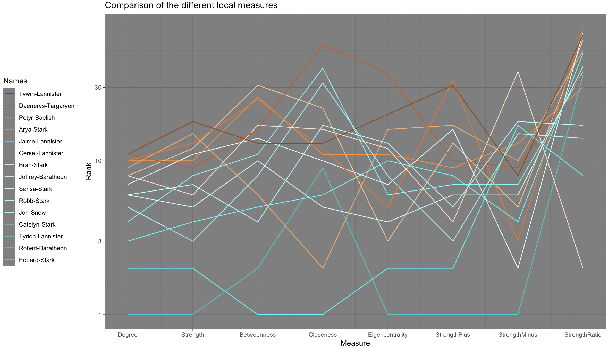

# Game of Thrones Network Analysis in R
This is a network analysis of Game of Thrones characters from the very first season to predict who will sit on the throne and who will die in the end.

Be aware! This analysis is dark and full of spoilers. Based on _dead_ characters, this analysis gives an overview of the relationships among each other.

For `Analysis_Game_of_Thrones.R` to work, you need:
- `GOT_network.csv` as the main data, a network of 150 characters of the first season with +/- and the # of encounters of each relationship
- `GOT_nodesdead.csv` as the vector of nodes with a 0/1 if they are dead/alive
- `GOT_coord.RDS`, the coordinates where I arranged the nodes in the final plot to be

The main plot in `Analysis_Game_of_Thrones.R` visualizes strength of relationships (# of encounters), quality (+/-), overall importance of the character as well as social clusters. The network analysis furthermore looks at the most important and central characters based on different centrality measures. `Paper_Game_of_Thrones.pdf` relates this point to quality of relationships. This reveals that the most central characters tend to result in having more negative relationships (possibly due to envy and the competition around "the Game of Thrones") and tend to die if not acting too diplomatically. This pattern can especially be observed in later seasons as well.

Said **main plot** looks like this in spoiler-free: 

With spoilers: [plot](graphs/GOT_network.png)

The overview of **centrality measures** looks like this:

With spoilers: [plot](graphs/GOT_centrality.png)
